  Parmi tous les types d'algorithmes existants, certains ont la particularité de s'inspirer de l'évolution des espèces dans leur cadre naturel. Ce sont les algorithmes génétiques. Les algorithmes génétiques (AG) sont des algorithmes d’optimisation stochastique fondés sur les mécanismes de la sélection naturelle et de la génétique. Leur fonctionnement est extrêmement simple. On part avec une population de solutions potentielles (chromosomes) initiales arbitrairement choisies. On évalue leur performance (fitness) relative. Sur la base de ces performances on crée une nouvelle population de solutions potentielles en utilisant des opérateurs évolutionnaires simples : la sélection, le croisement et la mutation. On recommence ce cycle jusqu’à ce que l’on trouve une solution satisfaisante. 

  Les AG ont été initialement développés par John Holland (1975). C’est au livre de Goldberg (1989) que nous devons leur popularisation. Leurs champs d’application sont très vastes. 

  Ce document aborde comme vous aurai pu le deviner le sujet des algorithmes génétiques. Il vous permettra de comprendre les concepts de base de cet algorithme et la terminologie utilisée pour les décrire. Nous aborderons également les différents opérateurs de croisement et de mutation, la sélection des survivants, et d'autres composants également.

  Après avoir parcouru ce document, le lecteur devrait acquérir suffisamment de connaissances pour trouver ses propres algorithmes génétiques pour un problème donné.

Voici le plan décliné dans le document :

**I- Historique des AG**

**II- Fondamentaux des AG**

    - 1. Qu'est ce que l'optimisation ?
    - 2. Que sont les algorithmes génétiques ?

**III- Description détaillée**

    - 1. Représentation d'un génotype
    - 2. Initialisation de la population 
    - 3. Fonction de fitness
    - 4. Selection des parents 
    - 5. Croisement
    - 6. Mutation
    - 7. Selection des survivants
    - 8. Fin de l'algorithme

**VI- Champs d'application**

**V- Particularités par rapport aux autres algorithmes**

**VI- Avantages et limites**

**VII- References**

\newpage

# I- Historique des AG

  Voyons tout de suite l’histoire de ces méthodes.

  Dans les années 1960, les avancées dans le domaine de la génétique permettaient de donner naissance au néodarwinisme ou Théorie synthétique de l’évolution. Elle stipule que l'évolution est basée sur la sélection naturelle de variations aléatoires du génome. Selon cette théorie, l'apparition de nouvelles espèces animales ou végétales et leur expansion découle des facteurs tels que les mutations génétiques et la sélection naturelle

.  La première structure de l’ADN avait été publiée en 1953 par Watson & Crick (1953) et avait permis de donner un cadre rigoureux à la théorie de Darwin (Darwin, 1859). La communauté scientifique a mis un certain temps à accepter toutes les implications de telles découvertes. 
  En effet, le néodarwinisme a permis de montrer que l’évolution des espèces au cours de l’histoire de la Terre résulte principalement de la combinaison d’une génération totalement aléatoire de diversité et d’une sélection. Cette diversité provient des mutations de l’ADN et des mécanismes de la reproduction sexuée. Le contraste entre la relative simplicité des mécanismes de base et la complexité des êtres vivants actuels ont démontré l’incroyable efficacité de l’évolution.

  Cette efficacité n’a évidemment pas échappé aux scientifiques d’autres domaines. En Allemagne, Rechenberg (1973) et Schwefel (1977) développèrent le concept « d’evolution strategy » tandis qu’aux Etats-Unis, Lawrence Fogel (Fogel, 1963; Fogel et al., 1966) et quelques autres introduisaient le « genetic programming ». Toutes ces contributions avaient en commun l’utilisation conjointe des concepts de mutation et de sélection. Ces deux concepts étaient considérés par Darwin comme prépondérants dans l’évolution naturelle. 

  Cependant, dès 1962, Bremer-mann et Fraser avaient inclus le concept de croisement dont les scientifiques contemporains avaient mesuré l’importance (bien que Darwin l’ait plutôt négligé). Une bonne partie de ce travail préliminaire a été rassemblé par le fils d’un de ces précurseurs dans Fogel (1998). 

  Mais, c’est finalement John Holland (1975) qui, le premier, a introduit le terme d’Algorithme génétique (AG). Dans son travail, la notion de croisement était primordiale. Cependant, il est assez étonnant d’observer que son ouvrage n’était absolument pas centré sur les problèmes d’optimisation. C’est son étudiant qui, dans sa thèse (De Jong, 1975), a focalisé son travail sur l’utilisation des AG dans la résolution des problèmes d’optimisation (De Jong, 1992). 

  Depuis, les AG ont beaucoup évolué et l’immense majorité des applications concernent des problèmes d’optimisation. Ce développement est essentiellement lié à l’augmentation rapide des capacités de calcul des ordinateurs. En effet, comme nous le verrons par la suite, ces algorithmes sont très gourmands en calculs et à l’époque de leur invention, cela limitait beaucoup leurs possibilités d’application. Mais aujourd’hui, les AG se révèlent être des outils d’optimisation très puissants, même pour des problèmes complexes. 

# II- Fondamentaux des AG et objectifs

## 1. Qu'est ce que l'optimisation ?
  
  
  Avant d'aller dans le vif du sujet, il est raisonnable de clarifier quels types de problèmes sont résolus avec les algorithmes génétiques. La réponse est simple et courte : les problèmes d'optimisation. L'optimisation est le fait de trouver des solutions optimales, c'est-à-dire des solutions qui ont une meilleure qualité que les autres. Nous recherchons souvent la solution optimale globale, qui est la meilleure solution dans l'ensemble de l'espace de solution. Cela peut être une tâche fastidieuse, car l'espace de solution peut souffrir de contraintes, de bruit, de conditions de fonction de fitness étranges, d'instabilité et d'un grand nombre d'optima locaux. S'ils sont modélisés de manière appropriée, les algorithmes génétiques sont capables de résoudre la plupart des problèmes d'optimisation qui se posent dans la pratique.
  
  Les problèmes d'optimisation se retrouvent dans de nombreux domaines, des sciences naturelles aux mathématiques et à l'informatique, de l'ingénierie à la vie sociale et quotidienne. Chaque fois qu'il s'agit de minimiser une erreur, de minimiser l'énergie, le poids, le gaspillage, l'effort et de maximiser le profit, le résultat, la réussite et les notes, nous sommes confrontés à des problèmes d'optimisation.

  Dans tout processus, nous avons un ensemble d'entrées et un ensemble de sorties comme le montre la figure suivante.
    

    
  L'optimisation consiste à trouver les valeurs des entrées de manière à obtenir les "meilleures" valeurs de sortie. La définition du "meilleur" varie d'un problème à l'autre, mais en termes mathématiques, elle fait référence à la maximisation ou à la minimisation d'une ou plusieurs fonctions objectives, en faisant varier les paramètres d'entrée.

  L'ensemble de toutes les solutions ou valeurs possibles que les entrées peuvent prendre constitue l'espace de recherche. Dans cet espace de recherche, se trouve un point ou un ensemble de points qui donne la solution optimale. L'objectif de l'optimisation est de trouver ce point ou cet ensemble de points dans l'espace de recherche.
    
    
## 2. Que sont les algorithmes génétiques ?

    
  Cette vidéo sur Youtube explicite très bien le concept: https://www.youtube.com/watch?v=ncj_hBfRt-Y&t=195s
  
  La nature a toujours été une grande source d'inspiration pour toute l'humanité. Les Algorithmes Génétiques (AG) sont des algorithmes de recherche basés sur les concepts de sélection naturelle et de génétique. Les AG sont un sous-ensemble d'une branche de calcul beaucoup plus importante connue sous le nom de calcul évolutionniste.
  
  
### a. Terminologies de bases
      
    
 Avant d'entamer une discussion sur les algorithmes génétiques, il est essentiel de se familiariser avec la terminologie de base qui sera utilisée. 
 
- Population - Il s'agit d'un sous-ensemble de toutes les solutions possibles (codées) au problème donné. La population pour un AG est analogue à la population pour les êtres humains, sauf qu'au lieu des êtres humains, nous avons des solutions candidates représentant des êtres humains.

- Chromosomes - Un chromosome ou individu est l'une des solutions possibles au problème donné.

- Gène - Un gène est un élément de position d'un chromosome.

- Allèle - C'est la valeur qu'un gène prend pour un chromosome particulier.

- Génotype - Le génotype est la population dans l'espace de calcul. Dans l'espace de calcul, les solutions sont représentées d'une manière qui peut être facilement comprise et manipulée à l'aide d'un système informatique.

- Phénotype - Le phénotype est la population dans l'espace des solutions du monde réel, dans lequel les solutions sont représentées d'une manière qui leur est propre dans des situations réelles.

- Décodage et encodage - Pour les problèmes simples, les espaces du phénotype et du génotype sont les mêmes. Cependant, dans la plupart des cas, les espaces du phénotype et du génotype sont différents. Le décodage est un processus de transformation d'une solution du génotype à l'espace du phénotype, tandis que l'encodage est un processus de transformation du phénotype à l'espace du génotype. Le décodage doit être rapide car il est effectué de manière répétée dans un AG lors du calcul de la valeur d'aptitude.
Prenons par exemple le problème du sac à dos 0/1. L'espace du phénotype est constitué de solutions qui ne contiennent que les numéros des articles à choisir.
Cependant, dans l'espace génotype, il peut être représenté comme une chaîne binaire de longueur n (où n est le nombre d'articles). Un 0 à la position x représente le xième élément à prélever, tandis qu'un 1 représente l'inverse. Il s'agit d'un cas où les espaces génotype et phénotype sont différents.

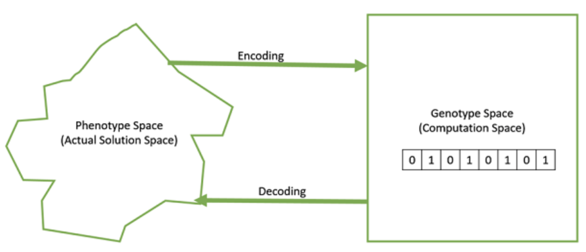

- Fonction de performance ou fitness - Une fonction de performance simplement définie est une fonction qui prend la solution comme entrée et produit la performance de la solution comme sortie. 

- Opérateurs génétiques - Ils modifient la composition génétique de la progéniture. Ils comprennent le croisement, la mutation, la sélection, etc.

### b. Fonctionnement
      
      
  Dans les AG, nous disposons d'un ensemble ou d'une population de solutions possibles au problème donné. Cette population peut être générée au hasard ou générée en utilisant les fonctions heuristiques. Ensuite nous sélectionnons les parents de cette population pour l'accouplement. On applique des opérateurs génétiques de sélection, de croisement et ou de mutation sur les parents pour générer de nouveaux rejetons. Finalement, ces descendants remplacent les individus existants dans la population et le processus se répète. De cette façon, les algorithmes génétiques tentent en fait d'imiter l'évolution humaine dans une certaine mesure. 
  
  

  Chaque individu (ou solution candidate) se voit attribuer une valeur d'aptitude (basée sur la valeur de sa fonction objective) et les individus les plus aptes ont plus de chances de s'accoupler et de donner naissance à des individus plus aptes. Ceci est conforme à la théorie darwinienne de la survie du plus fort.
  
  De cette manière, nous continuons à faire évoluer de meilleurs individus ou solutions au fil des générations, jusqu'à ce que nous atteignions un critère d'arrêt.

  Les algorithmes génétiques sont suffisamment aléatoires par nature, mais ils sont bien plus performants que la recherche locale aléatoire (dans laquelle nous nous contentons d'essayer diverses solutions aléatoires, en gardant une trace des meilleures jusqu'à présent), car ils exploitent également des informations historiques.
  
      
### c. Principes
      
  
  Les algorithmes génétiques utilisent la théorie de Darwin sur l’évolution des espèces.
Elle repose sur trois principes : le principe de variation, le principe d'adaptation et le principe d'hérédité.

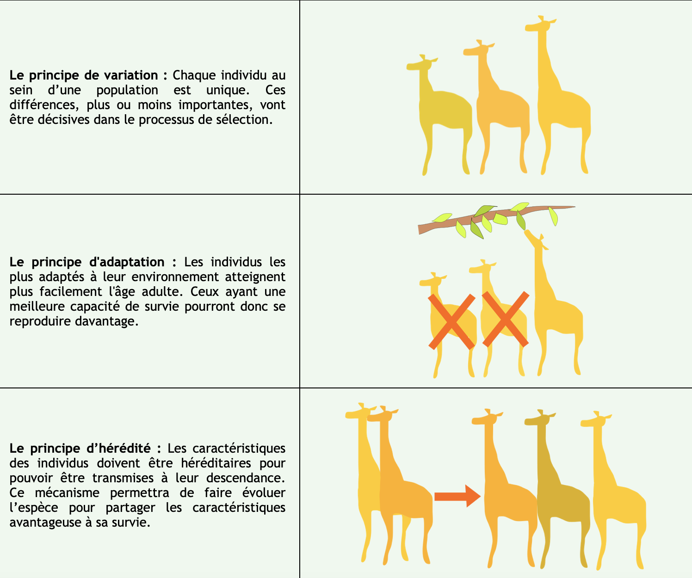

# III- Description détaillée

## 1. Représentation d'un génotype

  L'une des décisions les plus importantes à prendre lors de la mise en œuvre d'un algorithme génétique est de décider de la représentation que nous utiliserons pour représenter nos solutions. Il a été observé qu'une représentation incorrecte peut entraîner de mauvaises performances de l'AG.
  Dans cette partie, nous présentons quelques-unes des représentations les plus courantes pour les algorithmes génétiques. Cependant, la représentation est très spécifique à un problème et le lecteur pourrait trouver qu'une autre représentation ou un mélange des représentations mentionnées ici pourrait mieux convenir à son problème.
  
  
#### Représentation binaire

  Pour ce type de représentation, le génotype est constitué de chaînes de bits.Pour certains problèmes, lorsque l'espace de solution est constitué de variables de décision booléennes (oui ou non), la représentation binaire est naturelle.
  
  
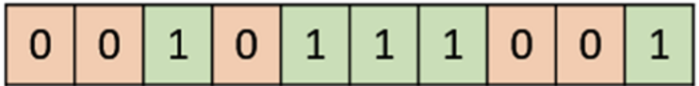

#### Représentation en valeur réelle

  Pour les problèmes où nous voulons définir les gènes en utilisant des variables continues plutôt que discrètes, la représentation de la valeur réelle est la plus naturelle. La précision de ces nombres à valeur réelle ou à virgule flottante est cependant limitée à l'ordinateur.
  
  

#### Représentation en nombres entiers

Pour les gènes à valeur discrète, nous ne pouvons pas toujours limiter l'espace de solution au "oui" ou au "non" binaire. Par exemple, si nous voulons coder les quatre distances - Nord, Sud, Est et Ouest, nous pouvons les coder sous la forme {0,1,2,3}. Dans ce cas, la représentation des nombres entiers est souhaitable.

#### Representation en permutation

  Dans de nombreux problèmes, la solution est représentée par un ordre d'éléments. Dans ces cas, la représentation par permutation est la plus adaptée.
  Un exemple classique de cette représentation est le problème du vendeur ambulant (TSP). Dans ce cas, le vendeur doit faire un tour de toutes les villes, visiter chaque ville une fois exactement et revenir à la ville de départ. La distance totale de la visite doit être réduite au minimum. La solution à ce problème de vendeur itinérant est naturellement un ordre ou une permutation de toutes les villes et l'utilisation d'une représentation de permutation est donc logique pour ce problème.
  
  

## 2. Initialisation de la population 

  Comme nous l'avions précédemment défini, la population est un sous-ensemble de solutions dans la génération actuelle ou un ensemble de chromosomes.
  Il existe deux méthodes principales pour initialiser une population dans un AG. Il s'agit des méthodes suivantes:
  
- Initialisation aléatoire: Populariser la population initiale avec des solutions complètement aléatoires.

- Initialisation heuristique:  Remplissez la population initiale en utilisant une heuristique connue pour le problème. L'idée principale des heuristiques est d'explorer l'espace des solutions en essayant de converger vers la meilleure solution.

  Il a été observé que la population entière ne devrait pas être initialisée en utilisant une heuristique, car cela peut avoir pour résultat que la population ait des solutions similaires et très peu de diversité. Il a été observé expérimentalement que les solutions aléatoires sont celles qui conduisent la population vers l'optimalité. Par conséquent, avec l'initialisation heuristique, nous n'avons qu'à ensemencer la population avec quelques bonnes solutions, en remplissant le reste avec des solutions aléatoires plutôt que de remplir toute la population avec des solutions basées sur l'heuristique.
  
    
## 3. Fonction de fitness

  La fonction de performance simplement définie est une fonction qui prend comme entrée une solution candidate au problème et produit comme sortie la mesure dans laquelle la solution est "bonne" par rapport au problème considéré.
  Le calcul de la valeur de performance est effectué de manière répétée dans un AG et doit donc être suffisamment rapide. Un calcul lent peut avoir un effet négatif sur un AG et le rendre exceptionnellement lent.
  L'image suivante montre le calcul de fitness pour un problème du sac à dos 0/1. Il s'agit d'une simple fonction de fitness qui additionne simplement les valeurs de profit des éléments choisis (qui ont un 1), en balayant les éléments de gauche à droite jusqu'à ce que le sac à dos soit plein.
  
  
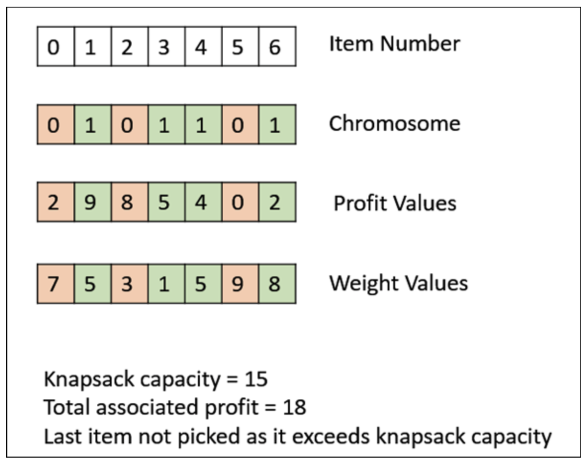  

## 4. Selection des parents 

    
  La sélection des parents est le processus où on choisit les parents qui vont s'accoupler pour créer des descendants pour la prochaine génération. La sélection des parents est très importante pour le taux de convergence de l'AG, car de bons parents poussent les individus à trouver des solutions plus adaptées et meilleures. 
Il existe différentes méthodes pour selectionner les parents

#### Sélection proportionnelle à la condition physique

  La sélection proportionnelle est l'un des moyens les plus populaires de sélection des parents. Chaque individu peut devenir un parent avec une probabilité proportionnelle à son aptitude. Par conséquent, les individus en bonne forme physique ont plus de chances de s'accoupler et de propager leurs caractéristiques à la génération suivante.
  
  Imaginez une roue circulaire. La roue est divisée en n part, où n est le nombre d'individus dans la population. Chaque individu obtient une partie du cercle qui est proportionnelle à sa valeur d'aptitude.Nous avons plusieurs points fixes comme le montre l'image suivante. Une méthode pour faire son choix est de faire tourner la roue; les régions de la roue qui se trouvent devant les points fixes sont choisies comme parents. Les point A et D sont choisis comme parents
  
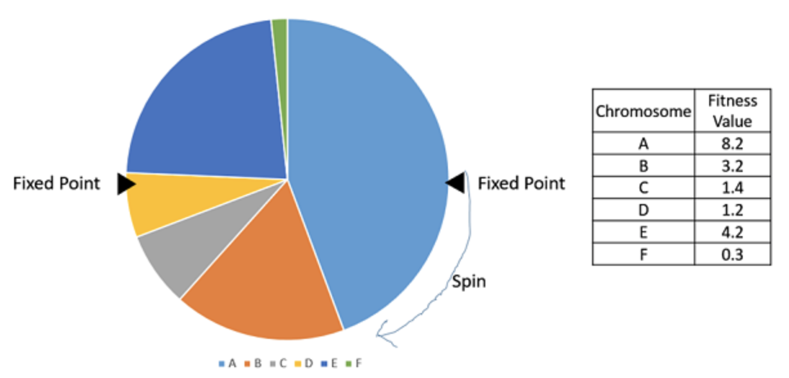   

#### Sélection des tournois

Lors de la sélection des tournois K-Way, nous sélectionnons au hasard K individus dans la population et choisissons les meilleurs d'entre eux pour devenir parent.

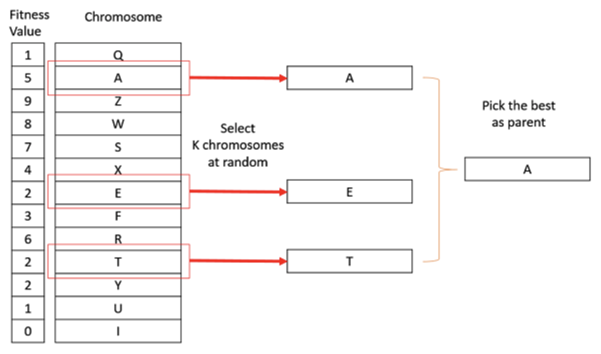   

#### Sélection des rangs

La sélection de rang fonctionne également avec des valeurs de forme physique négatives et est surtout utilisée lorsque les individus de la population ont des valeurs de forme physique très proches (cela se produit généralement à la fin de la course). Donc chaque individu, quelle que soit sa forme physique par rapport à l'autre, a approximativement la même probabilité d'être sélectionné comme parent. La sélection des parents dépend du rang de chaque individu et non de l'aptitude. Les personnes les mieux classées sont préférées à celles qui sont moins bien classées. 
On peut également utiliser la méthode de la roue pour les classer et cette fois-ci avec un point fixe unique.

#### Sélection aléatoire

Dans cette stratégie, nous sélectionnons au hasard des parents parmi la population existante. Il n'y a pas de pression de sélection vers des individus plus aptes et cette stratégie est donc généralement évitée.

## 5. Croisement
    
    
  L'opérateur de croisement est analogue à la reproduction et au croisement biologique. On applique le principe d’hérédité de la théorie de Darwin. Dans ce cas, plus d'un parent est sélectionné et une ou plusieurs descendances sont produites en utilisant le matériel génétique des parents. Le crossover est généralement appliqué dans un GA avec une probabilité élevée - pc .
  
  Il existe plusieurs méthodes de croisement

#### Un point unique de crossover

Dans ce croisement en un point, un point de croisement aléatoire est sélectionné et les queues de ses deux parents sont échangées pour obtenir de nouvelles descendances.

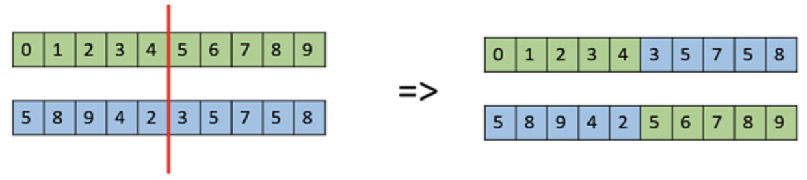  

#### Des points multiples de crossover

Le croisement multipoint est une généralisation du croisement en un point où des segments alternés sont échangés pour obtenir de nouveaux ressorts.

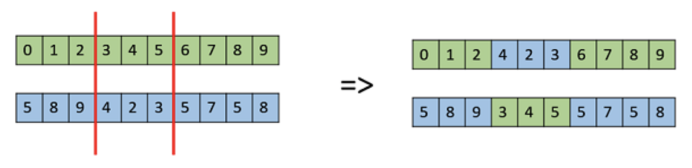  

#### Un crossover uniforme

Dans un crossover uniforme, nous ne divisons pas le chromosome en segments, mais nous traitons chaque gène séparément. Dans ce cas, nous tirons à pile ou face pour chaque chromosome afin de décider s'il sera inclus ou non dans la descendance. Nous pouvons également faire pencher la balance en faveur d'un parent, afin d'avoir plus de matériel génétique dans l'enfant de ce parent.

  

#### Recombinaison arithmétique complète

Cette méthode est couramment utilisée pour les représentations d'entiers et fonctionne en prenant la moyenne pondérée des deux parents en utilisant les formules suivantes:

$$child1 = α.x + (1-α).y$$
$$child2 = α.x + (1-α).y$$

Évidemment, si α = 0.5, alors les deux enfants seront identiques comme le montre l'image suivante.

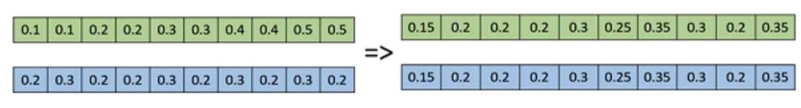    
   
   
## 6. Mutation
    
    
  En termes simples, la mutation peut être définie comme un petit ajustement aléatoire du chromosome, pour obtenir une nouvelle solution. Elle est utilisée pour maintenir et introduire de la diversité dans la population génétique et est généralement appliquée avec une faible probabilité - pm. Si la probabilité est très élevée, l'AG est réduite à une recherche aléatoire.
  Dans cette section, nous décrivons certains des opérateurs de mutation les plus couramment utilisés. Il ne s'agit pas d'une liste exhaustive
  
  
#### Mutation de bit flip

Dans cette mutation de bit flip, nous sélectionnons un ou plusieurs bits aléatoires et nous les retournons. Ceci est utilisé pour les AG à codage binaire.

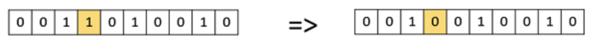   

#### Réinitialisation aléatoire

La réinitialisation aléatoire est une extension de l'inversion des bits pour la représentation des nombres entiers. Dans ce cas, une valeur aléatoire de l'ensemble des valeurs autorisées est attribuée à un gène choisi au hasard.

#### Mutation d'échange

Dans la mutation swap ou d'échange, nous sélectionnons au hasard deux positions sur le chromosome et nous échangeons les valeurs. C'est courant dans les codages basés sur la permutation.

#### Mutation d'inversion

Dans la mutation par inversion, nous sélectionnons un sous-ensemble de gènes comme dans la mutation par brouillage, mais au lieu de mélanger le sous-ensemble, nous inversons simplement la chaîne entière dans le sous-ensemble.

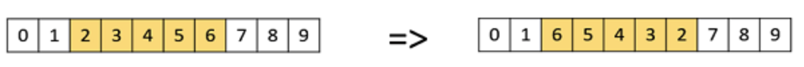   
  
  
## 7. Selection des survivants

    
  La politique de sélection des survivants détermine les personnes qui doivent être mises à la porte et celles qui doivent être conservées dans la génération suivante. Elle est cruciale car elle doit garantir que les personnes les plus aptes ne soient pas expulsées de la population, tout en maintenant la diversité de la population.  
  

#### Sélection en fonction de l'âge  

Dans la sélection par âge, nous n'avons pas la notion de forme physique. Elle repose sur le principe que chaque individu est autorisé à entrer dans la population pendant une génération limitée où il est autorisé à se reproduire, après quoi il est expulsé de la population, quelle que soit sa condition physique.

Par exemple, dans l'exemple suivant, l'âge est le nombre de générations pendant lesquelles l'individu a été dans la population. Les membres les plus âgés de la population, c'est-à-dire P4 et P7, sont exclus de la population et l'âge des autres membres est augmenté d'une unité.

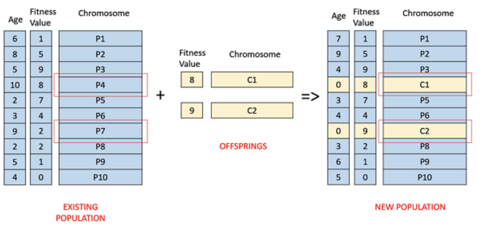   

#### Sélection basée sur l'aptitude physique

Dans cette sélection basée sur la condition physique, les enfants ont tendance à remplacer les individus les moins en forme de la population. La sélection des individus les moins en forme peut être effectuée en utilisant une variante de l'une des politiques de sélection décrites précédemment - sélection par tournoi, sélection proportionnelle à la condition physique, etc.

Par exemple, dans l'image suivante, les enfants remplacent les individus les moins en forme P1 et P10 de la population. Par exemple, dans l'image suivante, les enfants remplacent les individus les moins en forme P1 et P10 de la population. Il est à noter que puisque P1 et P9 ont la même valeur d'aptitude, la décision de retirer quel individu de la population est arbitraire.

   
  
   
## 8. Fin de l'algorithme
    
    
  La condition de fin d'un algorithme génétique est importante pour déterminer le moment de la fin d'un cycle d'AG. Il a été observé qu'au début, l'AG progresse très rapidement avec de meilleures solutions à quelques itérations d'intervalle, mais cela tend à saturer dans les étapes ultérieures où les améliorations sont très faibles. Nous voulons généralement que la condition de fin soit telle que notre solution soit proche de l'optimum, à la fin du cycle.

En général, nous conservons l'une des conditions de fin de cycle suivantes

- Lorsqu'il n'y a pas eu d'amélioration de la population pour X itérations.
- Lorsque nous atteignons un nombre absolu de générations.
- Lorsque la valeur de la fonction objectif a atteint une certaine valeur prédéfinie.

# IV- Champs d'application

Les algorithmes génétiques sont principalement utilisés dans des problèmes d'optimisation de toutes sortes, mais ils sont aussi fréquemment utilisés dans d'autres domaines d'application.

Dans cette section, nous énumérons quelques-uns des domaines dans lesquels les algorithmes génétiques sont fréquemment utilisés. Il s'agit des domaines suivants

- Optimisation - Les algorithmes génétiques sont le plus souvent utilisés dans les problèmes d'optimisation où nous devons maximiser ou minimiser la valeur d'une fonction objective donnée sous un ensemble donné de contraintes. L'approche pour résoudre les problèmes d'optimisation a été mise en évidence tout au long du tutoriel.

- Économie - Les AG sont également utilisés pour caractériser divers modèles économiques comme le modèle de la toile d'araignée, la résolution de l'équilibre de la théorie des jeux, l'évaluation des actifs, etc.

- Réseaux de neurones - Les AG sont également utilisés pour former les réseaux de neurones, en particulier les réseaux de neurones récurrents.

- Parallélisation - Les AG ont également de très bonnes capacités de parallélisation, et s'avèrent être des moyens très efficaces pour résoudre certains problèmes, et fournissent également un bon domaine de recherche.

- Traitement des images (image processing) - Les AG sont utilisés pour diverses tâches de traitement numérique des images (DIP) ainsi que pour la correspondance de pixels denses.

- Problèmes de routage des véhicules (vehicle routing problems) - Avec de multiples fenêtres de temps doux, de multiples dépôts et une flotte hétérogène.

- Applications de planification - Les AG sont également utilisés pour résoudre divers problèmes de planification, en particulier le problème de l'horaire.

- Apprentissage automatique (machine learning) - l'apprentissage automatique basé sur la génétique (GBML) est un domaine de niche dans l'apprentissage automatique.

- Génération de trajectoires de robot - Les AG ont été utilisées pour planifier la trajectoire d'un bras de robot en se déplaçant d'un point à un autre.

- Conception paramétrique des avions - Les AG ont été utilisés pour concevoir des avions en faisant varier les paramètres et en développant de meilleures solutions.

- Analyse de l'ADN - Les AG ont été utilisés pour déterminer la structure de l'ADN en utilisant des données spectrométriques sur l'échantillon.

- Optimisation multimodale - Les AG sont évidemment de très bonnes approches pour l'optimisation multimodale, dans laquelle nous devons trouver de multiples solutions optimales.

- Le problème du voyageur de commerce et ses applications - Les AG ont été utilisés pour résoudre le TSP, qui est un problème combinatoire bien connu utilisant de nouvelles stratégies de croisement et d'emballage.

# V- Particularités par rapport aux autres algorithmes

Les algorithmes génétiques ont la capacité de fournir une solution "assez bonne" et "assez rapide". Cela rend les algorithmes génétiques intéressants pour la résolution de problèmes d'optimisation. Les raisons qui les différencient des autres algorithmes sont les suivantes:

#### Résoudre les problèmes difficiles

En informatique, il y a un grand nombre de problèmes, qui sont "NP-Hard". Cela signifie essentiellement que, même les systèmes informatiques les plus puissants mettent beaucoup de temps (même des années !) à résoudre ce problème. Dans un tel scénario, les AG s'avèrent être un outil efficace pour fournir des solutions quasi optimales utilisables en peu de temps.

#### Échec des méthodes basées sur le gradient

Les méthodes traditionnelles basées sur le calcul fonctionnent en partant d'un point aléatoire et en se déplaçant dans la direction de la pente, jusqu'à ce que l'on atteigne le sommet de la colline. Cette technique est efficace et fonctionne très bien pour les fonctions objectives à un seul sommet comme la fonction de coût dans la régression linéaire. Mais, dans la plupart des situations du monde réel, nous sommes confrontés à un problème très complexe appelé "paysages", qui sont constitués de nombreux sommets et de nombreuses vallées, ce qui fait que ces méthodes échouent, car elles souffrent d'une tendance inhérente à se bloquer sur l'optima local, comme le montre la figure suivante.

#### Obtenir rapidement une bonne solution

Certains problèmes difficiles, comme le problème des vendeurs itinérants (TSP), ont des applications concrètes comme la recherche de chemin et la conception de VLSI. Imaginez maintenant que vous utilisez votre système de navigation GPS, et qu'il vous faut quelques minutes (voire quelques heures) pour calculer le chemin "optimal" de la source à la destination. Le retard dans ces applications du monde réel n'est pas acceptable et il faut donc une solution "suffisamment bonne", qui soit livrée "rapidement".

# VI- Avantages et limites

Il n’y a aucun doute que les algorithmes génétiques peuvent être utilisés pour traiter des problèmes d’optimisation. Leur performance relative varie cependant selon les contexte.s

#### Avantages des AG

Les AG présentent divers avantages qui les ont rendus immensément populaires. Parmi ceux-ci, on peut citer

- Ne nécessite aucune information dérivée (qui peut ne pas être disponible pour de nombreux problèmes du monde réel).

- Est plus rapide et plus efficace que les méthodes traditionnelles

- Possède de très bonnes capacités parallèles.

- Optimise les fonctions continues et discrètes ainsi que les problèmes multi-objectifs.

- Fournit une liste de "bonnes" solutions et pas seulement une solution unique.

- Obtient toujours une réponse au problème, qui s'améliore avec le temps.

- Utile lorsque l'espace de recherche est très vaste et qu'un grand nombre de paramètres sont impliqués.

- Très simples à mettre en place. En fait, une méthode de codage, des opérateurs de croisement et de mutation, ainsi qu’une fonction d’évaluation sont suffisants pour utiliser une approche évolutive. On obtient alors une approche robuste qui peut être très utile si la fonction à optimiser est « floue » (fuzzy) ou si on dispose de peu de temps pour étudier le problème à optimiser

- Peuvent également être combinés à d’autres approches d’optimisation pour donner lieu à des méthodes hybrides très puissantes, souvent parmi les meilleures disponibles. On peut par exemple utiliser des opérateurs de mutation plus sophistiqués pour optimiser le résultat de chaque croisement. Pour l’algorithme hybride résultant, la composante « génétique » vise alors à enrichir la recherche, en misant sur les éléments qui constituent sa force, i.e. l’utilisation d’une population diversifiée qui permet l’accès aux caractéristiques variées de plusieurs individus, et au processus de sélection (artificielle dans ce cas), afin d’orienter l’exploration vers les meilleures régions de l’espace de solutions. C’est bien là l’une des leçons à tirer de l’observation de la nature.

#### Limites des AG

Comme toute technique, les AG souffrent également de quelques limitations. Parmi celles-ci, on peut citer

- Les AG ne sont pas adaptées à tous les problèmes, en particulier aux problèmes simples pour lesquels des informations dérivées sont disponibles. Lorsqu’un problème est bien étudié, il est généralement préférable d’avoir recours à des algorithmes spécialisés qui peuvent tirer avantage de certaines structures spécifiques. Pour le problème TSP par exemple, des approches basées sur la programmation en nombres entiers peuvent maintenant résoudre de façon optimale des exemplaires de plusieurs dizaines de milliers de villes. Il serait donc mal avisé d’utiliser un algorithme génétique pour résoudre ce problème (à moins de vouloir étudier leur comportement, ce qui peut être tout à fait légitime et amusant)

- La valeur d'aptitude est calculée de manière répétitive, ce qui peut être coûteux pour certains problèmes.

- Équalité de la solution.

- Si elle n'est pas correctement mise en œuvre, l'AG peut ne pas converger vers la solution optimale.

# VII- References

- http://igm.univ-mlv.fr/~dr/XPOSE2013/tleroux_genetic_algorithm/index.html
- http://deptinfo.unice.fr/twiki/pub/Minfo04/IaDecision0405/Prsentationdesalgorithmesgntiquesetdeleursapplicationsenconomie_P.pdf
- https://khayyam.developpez.com/articles/algo/genetic/
- https://www.tutorialspoint.com/genetic_algorithms/genetic_algorithms_quick_guide.htm
- O. Kramer, Genetic Algorithm Essentials, Studies in Computational Intelligence 679, DOI 10.1007/978-3-319-52156-5_1
