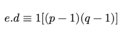
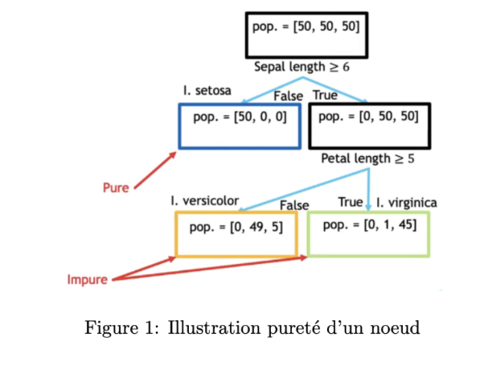
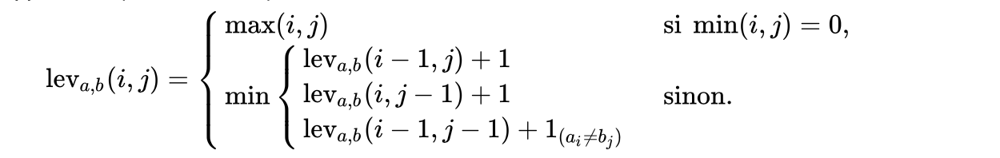
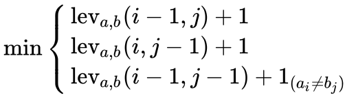
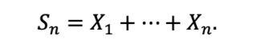
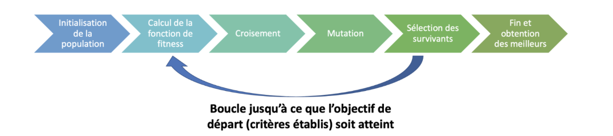

\newpage
# GENERALITES

*Le but de ce document est de résumer 6 travaux réaliser par les élèves en MSC Data Management à PSB et par moi même dans le cadre du cours en mathématiques pour le Big Data. A la fin de ce document, une évaluation de chaque étude effectuée sera réalisée suivant les critères énumérés ci-dessous: *  

- Critère 1: Lisibilité du document 
- Critère 2: Compréhension du sujet par l'auteur
- Critère 3: Qualité des explications fournies
- Critère 4: Equations et illustrations
- Critère 5: Bibliographie

\newpage
# I- CRYPTOGRAPHIE

## a- Auteurs

- AUTEUR: Marko ARSIC / Wiliam ROBACHE
- LIEN VERS LE DOSSIER GITHUB: (https://github.com/ARSICMrk/ARSIC_PSBx/tree/main/Maths_BD/Cryptographie)

## b- Synthese

  La cryptographie une discipline de la cryptologie, est un algorithme utilisé pour chiffrer ou déchiffrer une information ou des données afin d'assurer leur confidentialité (limiter leur accès), leur authenticité et leur intégrité .
  Les auteurs de ce tutoriel nous plongent dans le monde de la cryptographie en nous faisant découvrir des algorithmes populaires tels que: le cryptage à clé symétrique et asymétrique, le système RSA, le cryptage en ligne et l'informatique quantique ainsi que chacune de leurs limites.   

## c- Extrait

Le RSA utilise le chiffrement asymétrique où la clé de chiffrement diffère de celle de déchiffrement.Ce principe de cryptage est basé sur deux nombres premiers (p et q) qui doivent être très grands car ils constituent le centre du cryptage. Une fois déterminés, on pose deux équations: 
$$n = p*q$$ 
et 

$$ z = (p-1)*(q-1) $$
On cherche ensuite un nombre e < z qui doit être premier avec z puis on calcul la valeur d avec la formule de l'extrait pris du document:
 
$$d \equiv e^{-1} \mod (p-1)(q-1) \\$$
Finalement le couple (e,n) représente la clé publique et (d,n) représente la clé privée.

## d- Evaluation

Critère 1 : Document clair et lisible

Critère 2 : Le sujet est très bien maitrisé par les auteurs, et ils ont su aborder efficacement plusieurs algorithmes de cryptage

Critère 3 : Les explications sont claires et détaillées. 

Critère 4 : Quelques équations y figurent. Ça aurait été intéressant d'avoir les formules de cryptage et de décryptage proprement dites sous forme mathématique. 

Critère 5 : Les sources d'informations ont été ajoutées au document

## e- Conclusion

Qui dit information dit accès, et le type ou le degré de cet accès varie d'une  personne à l'autre. Il est donc interessant d'apprendre à utiliser les algorithmes de cryptage et de décryptage dans le chiffrement de nos informations. Le travail fourni par Marko et William nous permet de découvrir bon nombre d'entre eux ainsi que leurs différentes limites.

\newpage
# II- DECISION TREES

## a- Auteurs

- AUTEUR: BRETONNIER Corentin / Benjamin GUIGON / Antoine SERREAU
- LIEN VERS LE DOSSIER GITHUB: (https://github.com/aserreau/PSB1/tree/main/Travaux%20Mathématiques)

## b- Synthese

Les arbres de décision sot couramment utilisés dans l'analyse décisionnelle pour aider à identifier la stratégie la plus susceptible d'aider à atteindre un objectif. Concrètement c'est un schéma qui représente les différentes possibilités d'une série de choix interconnectés. Il en existe deux types: les arbres de régression (prédire une réponse quantitative) et les arbres de classification (prédire une réponse qualitative). Les auteurs présentent à travers leur tutoriel, une vue complète de l'utilisation de cet algorithme et terminent par leurs limites.

## c- Extrait
 
Pureté du noeud des arbres de régression : un noeud est qualifié de pur si tous les invidus associés apartiennent à la même classe. La base de données iris a été utilisée pour réaliser l'abre de décision ci dessous. Après la première classification qui permet de vérifier si la longueur du sépale est supérieure ou égale à 6cm, on obtient une population pure constituée uniquement de setosa. Le noeud associé est donc pur. Ce qui n'est pas le cas des noeuds qui sont à la profondeur 2.

## d- Evaluation

Critère 1 : Document clair et lisible

Critère 2 : Le sujet est très bien maitrisé et les auteurs sont allés plus loin en faisant une application en R. 

Critère 3 : Les explications sont claires et détaillées

Critère 4 : Des équations et illustrations ont été ajoutées

Critère 5 : Les auteurs ont omis d'ajouter les sources d'informations

## e- Conclusion

Le travail fourni par Corentin , Benjamin et Antoine est assez riche et permet de mieux comprendre l'algorithme Decision Trees. A la fin de leur tutoriel, ils nous orientent vers celui d'un camarade de la promotion pour aller plus loin. Ce qui montre qu'ils ont une continuité dans leurs idées.

\newpage
# III- EMOJIS

## a- Auteurs

- AUTEUR: Marion DANYACH / Imen DERROUICHE / Olfa LAMTI
- LIEN VERS LE DOSSIER GITHUB: (https://github.com/imenderrouiche/PSBX/blob/main/Approche%20mathématiques%20-%20Émojis.ipynb)

## b- Synthese

Le sujet abordé par Marion, Imen et Olfa est un sujet assez intéressant qui traite de la prédiction automatique d'emojis. Elles ont réalisées une étude partielle d'une thèse qui portait sur la recommandation automatique et adaptative d'emojis. Dans leur rapport, elles font appel à l'algorithme de Levenshtein qui est utilisé pour déterminer la distance entre deux mots A et B en effectuant des opérations élémentaires. Elles nous proposent une étude de cet algorithme, son fonctionnement et ses limites.

## c- Extrait

Cet extrait représente l'algorithme de Levenshtein. Je me suis permise de le récupérer plutôt sur Wikipédia pour qu'on y voit apparaitre min(i,j) = 0

a et b sont les mots à analyser et i et j leurs longueurs respectives.

lev(a,b) se définit par récurrence suivant cette règle:

- Si a et b sont vides lev (a,b) vaut max(i,j) et donc 0
- Sinon si a est vide lev(a,b) = max(i,j) et donc j
- Sinon si b est vide lev(a,b) = max(i,j) et donc i
- Sinon on renvoie le min de ces valeurs:

Ce qui pousse à recalculer le Levenstein et ainsi de suite.

## d- Evaluation

Critère 1 : Le fichier est assez épuré et rend la lecture aisée

Critère 2 : Le sujet est très bien maitrisé par les auteurs

Critère 3 : Les explications sont claires et détaillées

Critère 4 : On retrouve dans le document l'énoncé de l'algorithme de Levenshtein illustrations à l'appui

Critère 5 : Les auteurs ont ajouté les sources d'informations

## e- Conclusion

L'algorithme de Levenshtein qui mesure la distance entre deux mots permet ainsi de prédire la similitude qui existe entre ces mots. Ceci facilite ainsi la recommandation d'emojis à partir des mots que nous saisissons. Grâce à l'étude de Marion, Imen et Olfa on a un cas d'utilisation dans la vie courante de l'algorithme de Levenshtein.

\newpage
# IV- MARCHE ALEATOIRE

## a- Auteurs

- AUTEUR: Marko ARSIC / William ROBACHE
- LIEN VERS LE DOSSIER GITHUB: (https://github.com/ARSICMrk/ARSIC_PSBx/tree/main/Maths_BD/Marche_aleatoire)

## b- Synthese

La marche aléatoire ou encore appelée la marche de l'ivrogne est un modèle mathématique dans lequel la dynamique d'un système se compose d'une sucession de pas aléatoires, où le futur du système dépend uniquement de son état présent et pas de son passé, même pas celui le plus proche. C'est que nous présentent Marko et William dans leur tutoriel en nous apportant une vision mathématique du modèle. On peut y retrouver le concept de marche aléatoire isotrope, le principe de PageRank ...

## c- Extrait
 

Cette fonction représente la marche aléatoire associée à une suite de variables aléatoires (Xi)

Dans l'analyse des marches aléatoires, on cherche souvent à savoir si le modèle retourne au point de départ autrement dit à l'origine.

Selon le théorème de Polya la marche finit par repasser par l'origine lorsqu'on a une probabilité de 1 et on dit ainsi que la marche aléatoire est récurrente. Dans le cas contraire elle est dite transiente. Ce théorème n'est plus vérifiée si la marche aléatoire se déroule dans l'espace.

## d- Evaluation

Critère 1 : Document assez épuré et facile à parcourir

Critère 2 : Les auteurs maitrisent leur sujet. 

Critère 3 : Ils ont pu fournir des explications détaillées des principes abordés

Critère 4 : Formules mathématiques et illustrations sont utilisées pour expliquer le modèle 

Critère 5 : Les auteurs ont ajouté leurs sources

## e- Conclusion

Le travail fourni par Marko et William est assez riche et permet de mieux comprendre la marche aléatoire. Le résumé ajouté à la fin aide à mieux comprendre le principe de PageRank.

\newpage
# V- REGRESSION LOGISTIQUE

## a- Auteurs

- AUTEUR: Gaspard PALAY
- LIEN VERS LE DOSSIER GITHUB: (https://github.com/GaspardPalay/PSBX/blob/main/Regression%20Logistique/Regression_Logistique%20_Maths.pdf)

## b- Synthese

La régression logistique fait opposition à la régression linéaire qui permet d'analyser des variables quantitatives. La régression logistique sert elle à analyser la relation entre une variable qualitative Y et des variables quantitatives (X1, ...Xj) . C'est ce que explique Gaspard dans son étude de cet algorithme. Il nous permet de découvrir une approche mathématique de l'algorithme et va plus loin en effectuant une application avec le code R.

## c- Extrait
 L'hypothèse fondamentale de la régression logistique

Dans cette équation x1, x2, ... , xj représentent respectivement les valeurs prises par les variables aléatoires (X1, X2, ..., Xj). 
Cette hypothèse a été popularisée par I.J Good, E.T Jaynes et Myron Tribuset on y reconnait la mesure nommée "évidence" qu'on formule ainsi: $$Ev(p) = ln(p / (1-p))$$
Notons que: $$P(X/Y = -)  =  1- P(X/Y = +) $$

Elle a été introduite afin de rendre calculable la quantité: $$P(X/ Y = yk)$$ 

avec yk ∈ (+,-) 

## d- Evaluation

Critère 1 : Document clair et lisible

Critère 2 : L'auteur maîtrise le principe de base de la régression logistique

Critère 3 : Les explications auraient pu être mieux approfondies pour faciliter la compréhension du sujet par le lecteur

Critère 4 : On retrouve les formules mathématiques de la régression logistique dans le document et une application faite sous R

Critère 5 : L'auteur a bel et bien ajouté les sources utilisées

## e- Conclusion

La régression est un algorithme très souvent utilisé en mathématiques. Il est nécessaire de le connaitre et de savoir l'appliquer. Gaspard dans son tutoriel nous aide à reconnaitre la régressio logistique et à assimiler ses principes de base. 

\newpage
# VI- ALGORITHME GENETIQUE: AUTO EVALUATION

## a- Auteurs

- AUTEUR: Florine COMLAN
- LIEN VERS LE DOSSIER GITHUB: (https://github.com/fcom-stack/PSBX/tree/main/Algorithme_genetique)

## b- Synthese

Les algorithmes génétiques sont des algorithmes d'optimisation qui sont inspirés de l'évolution de l'espèce dans son cadre naturel.Basés sur les mécanismes de la sélection naturelle, leur objectif est d'aider par itération à converger vers la meilleure solution à notre problème. Dans notre document nous avons présenté l'historique de cet algorithme, explicité ses principes et son fonctionnement, la spécificité de cet algorithme par rapport aux autres, ses champs d'application et nous avons terminé par ses limites. 

## c- Extrait
 
Cet extrait résume le fonctionnement de l'algorithme génétique. Tout d'abord, on initue une population constituée d'individus. On les fait ensuite passer par la fonction de fitness qui permet d'évaluer les individus de la population et d'en choisir les meilleurs (on parle de la sélection des parents). Ses parents s'accouplent par croisement et ou mutation et on obtient des nouveaux individus qu'on ajoute à la population initiale. S'en suit la sélection des survivants où on utilise la fonction de fitness pour sélectionner les maillons faibles de la population et les supprimer et le cycle recommence jusqu'à l'obtention d'une solution satisfaisante: c'est le fonctionnement de l'algorithme génétique.

## d- Evaluation

Critère 1 : Document claire et lisible

Critère 2 : Le sujet est maitrisé 

Critère 3 : Les explications sont claires et détaillées

Critère 4 : Il y a très peu de formules mathématiques mais chacun des principes abordés ont été illustrés

Critère 5 : Les sources ont été ajoutées

## e- Conclusion

L'algorithme génétique est une bonne alternative dans les circonstances où les algorithmes de base atteignent leurs limites. Il est assez intéressant de l'étudier et de jauger son efficacité.

\newpage
# VII- SYNTHESE GLOBALE

Parcourir les travaux de mes camarades et les comparés aux miens m'a donné une vision plus précise de ce qu'est un travail bien achevé en terme de visuel, de contenu, du point de vue explicatif et illustratif.

Par rapport au visuel nous avons majoritairement fait l'effort de bien structurer notre travail afin d'obtenir un rendu assez agréable à lire. Cependant un plus aurait été d'ajouter un plan de l'étude au début du document pour aider l'utilisateur à se retrouver lorsqu'on nous lie. Ce que je n'ai pas forcément retrouver dans les documents de mes camarades. Par ailleurs j'ai remarqué que certains ont une maitrise avancée de Latex et on pu obtenir non seulement un rendu agréable à lire mais aussi attractif. Je pourrais m'inspirer de leur travaux dans mes prochains rapports.

En terme de contenu, chacun de mes camarades et moi même avions essayé d'illustrer nos explications par des cas d'usage concrets afin de faciliter aux lecteurs la compréhension de notre étude. Ceci est un point positif à conserver à l'avenir. Certains sont allez plus loin en orientant le lecteur vers un autre sujet en rapport au leur, ce que j'ai trouvé très appréciable.

Enfin certains de mes camarades ont oublié d'ajouter leurs références. Il est nécessaire de toujours préciser ses sources lorsqu'on travail un sujet donné et qu'on fait l'usage de documents qui ne nous appartiennent pas.

