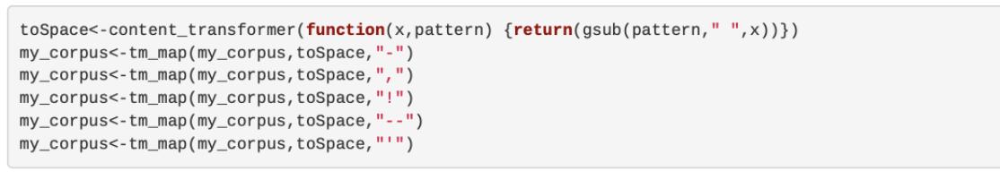
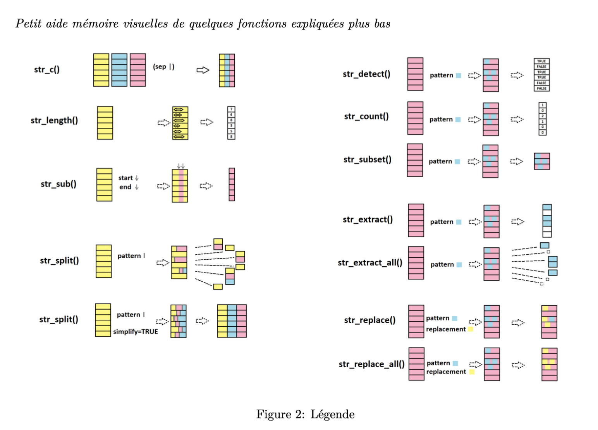

\newpage
# GENERALITES

*Le but de ce document est de résumer 6 travaux réaliser par les élèves en MSC Data Management à PSB et par moi même dans le cadre du cours en R. A la fin de ce document, une évaluation de chaque étude effectuée sera réalisée suivant les critères énumérés ci-dessous: *  

- Critère 1: Lisibilité du document 
- Critère 2: Compréhension du sujet par l'auteur
- Critère 3: Qualité des explications fournies
- Critère 4: Code fonctionnel
- Critère 5: Bibliographie


\newpage 
# I- EXTRAIRE LE CONTENU D'UN PDF AVEC R

## a- Auteurs

- AUTEUR: Chaymae GASMI
- LIEN VERS LE DOSSIER GITHUB: (https://github.com/chaymae-data/PSBX/blob/main/Extraire%20le%20contenu%20du%20PDF%20avec%20R.Rmd)


## b- Synthese

Dans son travail, Chaymae explique comment extraire le contenu d'un fichier pdf en se servant à la fois des packages pdftools et tm et comment nettoyer le contenu extrait pour effectuer des analyses sémantiques. Concrètement, elle installe tout d'abord les packages. Par la suite en se servant des fonctions de ces packages, elle importe puis traite le contenu du fichier pdf (un speech de Martin Luther King, un article sur la liberté d'expression). Enfin elle consacre une section assez détaillée sur l'analyse des textes (text mining)


## c- Extrait

Installation du package pdftools puis extraction: en se servant de la fonction "download.file", elle télécharge le fichier en local, puis stocke son contenu grace à la fonction pdf_text du package. Enfin elle affiche le texte de la page 1

```{r setup, include=TRUE}
#install.packages("pdftools")
library(pdftools)
```

```{r eval=FALSE, include=TRUE}
download.file("https://www.btboces.org/Downloads/I%20Have%20a%20Dream%20by%20Martin%20Luther%20King%20Jr.pdf","I%20Have%20a%20Dream%20by%20Martin%20Luther%20King%20Jr.pdf", mode = "wb")
text <- pdf_text("I%20Have%20a%20Dream%20by%20Martin%20Luther%20King%20Jr.pdf")
text1 <- strsplit(text, "\n")
cat(text[1])
```

Elle suit un procédé similaire avec les fonctions du package tm mais cette fois en faisant du nettoyage en profondeur. Dans ce bout de code, elle remplace les ponctuations du fichier par des espaces. 


Elle fait aussi appel à des fonctions tels que removeNumbers supprimer pour les chiffres, removeWords (enn précisant la langue anglaise) pour  supprimer les mots en anglais ...

Enfin elle a utilisé le package WordCloud pour générer un nuage de mots:

```{r}
#install.packages("wordcloud")
library(wordcloud)
#install.packages("RColorBrewer")
library(RColorBrewer)
```

```{r}
??wordcloud
```


## d- Evaluation

Critère 1 : Le document a été bien rédigé ce qui a permis d'avoir un résultat assez épuré

Critère 2 : Pour avoir fait preuve d'un approfondissement du sujet, on peut estimer que l'auteur maitrise le thème abordé

Critère 3 : Les fonctions utilisées ont été très bien expliquées. Le tutoriel est accessible à tout le monde 

Critère 4 : Le code écrit fonctionne globalement (même il y a quelques  coquilles dans l'import des packages)

Critère 5 : La bibliographie a été ajoutée à la fin du document


## e- Conclusion

Le travail de Chaymae est assez complet et répond au delà des espérances à la problématique posé. Avec son tutoriel, on arrive à importer le fichier pdf mais plus encore, on a quelques astuces pour faire du texte mining. 


\newpage
# II- CREER UNE CARTE AVEC R


## a- Auteurs

- AUTEUR: Thomas MASSE
-LIEN VERS LE DOSSIER GITHUB: (https://github.com/Thomas-MAS/PSB1/blob/main/CreateAmap.Rmd)


## b- Synthese

Dans son tutoriel, l'auteur a bour objectif de montrer comment créer une carte géographique depuis l'extraction de données jusqu'à l'étape visualisation. Pour ce faire, il s'est servi du package "Raster". Il a tout d'abord installer le package en question, puis, présenter la fonction "getData" qui permet d'obtenir des données géographiques. Enfin il est passé à la création des cartes proprement dite en mettant l'accent sur les différentes possibilités qu'offre le package "Raster"


## c- Extrait

Installation des packages à utiliser
```{r message=FALSE, warning=FALSE, class.source="watch-out", paged.print=TRUE, results=FALSE}
#install.packages("raster", repos = "http://cran.us.r-project.org")
#install.packages("rgdal", repos = "http://cran.us.r-project.org")
#install.packages("RCurl", repos = "http://cran.us.r-project.org")
```

```{r, message=FALSE, class.source="watch-out"}
library(raster)
library(rgdal)
library(RCurl)
```

Les diférents bouts de codes qui suivent nous permettent de représenter différentes cartes en se servant du package Raster et en particulier de la fonction getData. 

    - La carte **name="alt"** : altitude
    - La carte **name="GADM"** : représente les frontières administratives
    - La carte **worldclim** : représente les données climatiques interpolées
    - La carte **SRTM** : the hole-filled

```{r}
maCarteAlt <- getData(name="alt", country="GBR")
plot(maCarteAlt, main="Carte alt")
```

```{r}
maCarteGadm <- getData(name="GADM", country="GBR", level=1)
plot(maCarteGadm, main="Carte GADM")
```

```{r eval=FALSE}
maCarteWorldclim <- getData('worldclim', var='tmin', res=0.5, lon=0, lat=55)
plot(maCarteWorldclim, main="Carte Worldclim")
```

```{r eval=FALSE}
maCarteSrtm <- getData("SRTM", lon=-2, lat=57)
plot(maCarteSrtm, main="Carte SRTM")
```


## d- Evaluation

Critère 1 : Document très bien formatée et lisible

Critère 2 : L'auteur maitrise le sujet abordé

Critère 3 : Le travail effectué suit une certaine chronologie et rend sa compréhension aisée

Critère 4 : Les blocs de code en R s'exécutent correctement

Critère 5 : Les sources d'information ont été ajoutées par l'auteur 


## e- Conclusion

Le but de ce tutoriel est atteint dans le sens où il est assez accessible ( explications claires) et permet aisément de créer des cartes en R. L'auteur aurait pu se servir des packages classiques tels que ggmap, mais a préféré apporter une certaine plus-value à son tutoriel en utilisant raster. 


\newpage
# III- LE PACKAGE STRINGR

## a- Auteurs

- AUTEUR: Léonard BOISSON
- LIEN VERS LE DOSSIER GITHUB: (https://github.com/LeoBsn/PSB-PROJECT/blob/main/Manipuler%20des%20string%20avec%20R.pdf)


## b- Synthese

stringR est un package qui fournie 4 grandes familles de fonctions:

    - La manipulation de caractères individuels à l'intérieur des chaines de caractères
    - Des outils d'ajout, de supression et de manipulations des espaces blancs
    - Des outils pour des opérations locales à caractère sensible
    - Des fonctions de correspondances de caractères

Dans son tutoriels, Léonard parcourt ces différentes fonctions en nous donnant des exemples d'utilisation.


## c- Extrait

L'image suivante résume très bien tout le travail effectué sur le package stringR. Elle présente les différentes fonctionnalités de ce package et leur utilisation.


Nous avons la fonction str_split() qui transforme une chaine de caractères en tableau en la découpant à l'aide d'un délimiteur. En général le délimiteur utilisé est l'espace. Mais par exemple dans le cas des données contenues initialement dans un fichier csv, on pourrait utiliser la virgule ou le point virgule.

D'autre part, la fonction str_sub permet d'extraire les caractères d'une chaîne d'un emplacement a à un emplacement b

Application en R:

```{r}
library('stringr')
```

```{r eval=FALSE}
library(readxl)
```

```{r eval=FALSE}
d <- read_excel("C:/Users/leona/netflix_titles.xlsx", col_types = c("text", 
    "text", "text", "text", "text", "text", 
    "text", "text", "text", "text", "text", 
    "text"))
d
```

```{r eval=FALSE}
str_sub(d$type, 1, 4)
```

Le fichier utilisé (netflix_titles.xlsx) n'a pas été mis à disposition pour les tests


## d- Evaluation

Critère 1 : Le fichier est assez épuré et rend la lecture aisée

Critère 2 : L'auteur maitrise correctement son sujet

Critère 3 : Les différentes fonctions du package ont été parcourues et expliquées de façon très explicite. Un plus aurait été l'utilision du package dans un contexte réel.

Critère 4 : Je n'ai pas pu tester le fonctionnement du code compte tenu que le fichier utilisé n'a pas été mis à disposition. Cependant le fichier pdf généré témoigne du bon fonctionnement du code.

Critère 5 : Les sources d'information ont été ajoutées par l'auteur 


## e- Conclusion

L'image ajouté au début du tutoriel permet à l'utilisateur de se retrouver et de mieux comprendre le package présenté. C'est aussi assez intéressant d'avoir l'application en R des différentes fonctions du package stringR


\newpage
# IV- LE PACKAGE GGPLOT2

## a- Auteurs

- AUTEUR: ALLAKER Maxime / CHANEMOUGAM Siva
- LIEN VERS LE DOSSIER GITHUB: (https://github.com/mallaker/PSB_X/tree/main/Paquet%20ggplot2%20et%20Esquisse)


## b- Synthese

ggplot2 est un package utilisé pour faire de la visualisation de données sour R. Dans leur travail, les auteurs ont tout d'abord présenter le package. S'en est suivi son installation, la présentation de quelques graphiques conventionnelles en se servant des données sur la qualité de l'air, d'un tracé par défaut avec les données "Iris", d'un tutoriel sur la modification des légendes, le tracé de nuages de points et de Gigue, le tracé de diagramme à barres et histogrammes, et pour finir le tracé de graphique à secteurs, de graphiques à bulles et de graphiques divergents


## c- Extrait

```{r}
#install.packages ( "ggplot2" )
library(ggplot2) # installation de la librairie "esquise"
```

```{r}
#chargement du jeu de données
data(iris)
head(iris)#affichage des 6 premieres lignes du jeu de données
```

Avec leur tutoriel on découvre différents graphiques utilisés dans la visualisation de données et les syntaxes pour leur tracé. Ceux qui sortent de l'ordinaire: 

- Le tracé de nuages de points avec droite de régression: permet de montrer la corrélation entre une variable et une autre

```{r}
ggplot(iris, aes(Sepal.Length, Petal.Length, colour=Species))+ geom_point(shape=1)+ geom_smooth(method=lm)
```

- Le tracé de Gigue: permet de représenter des tracés dispersés


```{r}
ggplot (mpg, aes (cyl, hwy)) +  geom_point ( ) + geom_jitter (aes (color = class))
```


- Le graphique de sucettes divergentes : encore appelé graphique lollipop est une alternative aux bar plots lorqu'on dispose un d'un grand jeu de données.

```{r}
data("mtcars")
head(mtcars)
```

```{r}
#On crée une nouvelle colonne dénommée car name
mtcars$'car name' <- rownames(mtcars)
#calcul des mpg normalisés en (km)
mtcars$mpg_z <- round((mtcars$mpg - mean(mtcars$mpg))/sd(mtcars$mpg),2)
#au dessus / au dessous de zero 
mtcars$mpg_type <- ifelse(mtcars$mpg_z < 0, "below" , "above")
#Tri
mtcars <- mtcars[order(mtcars$mpg_z),]

#convertissons
mtcars$'car name'<- factor(mtcars$'car name', levels = mtcars$'car name')
```


```{r}

ggplot(mtcars, aes(x = 'car name', y = mpg_z , label = mpg_z)) +
  geom_point (stat='identity', fill = "black", size = 6) +
  geom_segment( aes(x = 'car name', xend = 'car name', y = 0, yend = mpg_z), color = "black") + 
  geom_text (color = "white " , size = 2)+
  labs (title = "Diverging Lollipop Chart ", subtitle = "Kilométrage normalisé depuis 'mtcars ': Lollipop ") +
     ylim (-2.5, 2.5) +  coord_flip ( )

```


## d- Evaluation

Critère 1 : Globalement le document est lisible même si il y a quelques petites coquilles (des paragraphes qui se chevauchent, des codes qui apparaissent de manière partielle)

Critère 2 : Les auteurs maitrisent le sujet abordé et cela explique la richesse de leur contenu

Critère 3 : Il aurait été préférable de présenter les bases du package avant de se lancer dans les cas d'utilisation. Ce qui n'a pas été fait. J'espérais aussi une interprétation des graphiques obtenus

Critère 4 : Le code écrit fonctionne. Les graphiques qui apparaissent sont conformes aux résultats attendus

Critère 5 : Les auteurs ont omis d'ajouter leurs sources d'informations


## e- Conclusion

Le travail de Maxime et Siva est assez riche. Il reprend les cas d'utilisation du package dans ses moindres détails. Cependant il est plus adapté aux personnes ayant une certaine base dans la manipulation du package ggplot2.


\newpage
# V- LE PACKAGE LUBRIDATE

## a- Auteurs

- AUTEUR: Gaspard PALAY
- LIEN VERS LE DOSSIER GITHUB: (https://github.com/GaspardPalay/PSBX/tree/main/TutorielLubridate)


## b- Synthese

Il peut être frustrant de travailler avec des données date-heure dans R. Les commandes R pour les date-heures sont généralement peu intuitives et changent en fonction du type d'objet date-heure utilisé. Le package Lubridate vient répondre à se besoin. Il est utilisé pour transformer un vecteur de classe "chaîne de caractères" en un vecteur de classe "date". Son objectif principal est de donner le qualificatif "temps" dans R à une chaine de caractères. Dans son tutoriel Gaspard a tout d'abord explicité les bases de ce package et  patr la suite l'a utilisé pour effectuer des calculs arithmétiques sur les dates. Pour finir il a présenté l'heure POSIX  


## c- Extrait

Installation du package

```{r,echo=TRUE,eval=FALSE}
install.packages("lubridate")
```


```{r,include=FALSE,eval=TRUE}
library(lubridate)
```

Pour utiliser le package Lubridate, il suffit de noter dans quel ordre les éléments de la chaine de caractères viennent. Un exemple avec dmy : day , month , year

```{r,echo=TRUE,eval=TRUE}
jourJ <- lubridate::dmy("30 may 2020")
class(jourJ)
```

POSIX (Portable Operating System Interface) est une norme qui permet de garantir le développement d'applications portables au niveau du code source, entre les systèmes d'exploitation conformes à la norme.

Le package Lubridate mets à disposition un analyseur POSIX intégré: l'exemple de is.Date()

***is.Date()*** vérifie si un objet hérite de la classe Date. 
```{r,echo=TRUE,eval=FALSE}
is.Date(as.Date("2009-08-03")) 
```


## d- Evaluation

Critère 1 : Fichier très bien formaté et lisible

Critère 2 : L'auteur maitrise son sujet

Critère 3 : Les différentes fonctions du package ont été parcourues et expliquées de façon très explicite. 

Critère 4 : Pour avoir tester le  code du fichier .rmd, il fonctionne très bien

Critère 5 : L'auteur a omis d'insérer les sources d'informations


## e- Conclusion

Lubridate apporte un plus au langage R dans le sens où il rend aisé la manipulation des variables de type date. Gaspard a travers son tutoriel, nous présente concrètement comment faire usage de ce package.


\newpage
# VI- LE PACKAGE RMR2: AUTO EVALUATION


## a- Auteurs

- AUTEUR: Florine COMLAN
- LIEN VERS LE DOSSIER GITHUB: (https://github.com/fcom-stack/PSBX/blob/main/Hadoop_et_spark/Packages_Sparklyr_et_rmr2/rmr2.pdf)


## b- Synthese

Le package rmr2 permet au développeur R d'utiliser la fonctionnalité  MapReduce de l'outil Hadoop. Dans notre document, nous avons tout d'abord fait un petit rappel de ce que c'est que le mapReduce. Par la suite nous avons énuméré les fonctions de base de ce package que nous avons utilisé concrètement dans des applications élémentaires. Pour finir nous avons fait l'usage de ces fonctions dans des applications de la vie courante telles que le comptage de mots, le comptage d'entiers ou encore l'application à la régression linéaire.


## c- Extrait

Installation du package

```{r eval=FALSE}
#install.packages("devtools")
library(devtools)
```

```{r eval=FALSE}
#devtools::install_github(c('RevolutionAnalytics/rmr2/pkg'))
```


Pour réaliser le map reduce on utilise la fonction mapreduce du package. Cette fonction contient trois paramètres: 

    - "input" est l'ensemble de données à traiter ;
    - "map" est la fonction appelée pour cartographier les données en paires clé-valeur ;
    - "reduce" traite le sous-ensemble de données et renvoie le résultat avec sa clé.

Voici un exemple:

```{r}
library(rmr2) 
rmr.options(backend = "local")
entiers <- to.dfs(1:10) 
calcul2.map = function(k,v){ keyval(1,v^2)}
calcul2.reduce = function(k,v){sum(v) }
calcul2 <- mapreduce( input = entiers, map = calcul2.map, reduce = calcul2.reduce)
resultat2 <- from.dfs(calcul2) 
resultat2                      
```

## d- Evaluation

Critère 1 : Fichier très bien formaté et lisible

Critère 2 : Pour avoir fait preuve d'un approfondissement du sujet, on peut estimer qu'on maitrise le thème abordé

Critère 3 : Il convient d'avoir initialement lu le tutoriel fait sur le fonctionnement de Hadoop pour pouvoir mieux comprendre les fonctions utilisées dans le package rmr2. La section rappel permet d'initier le lecteur au fonctionnement du package

Critère 4 : Le code est fonctionnel

Critère 5 : Les différentes sources d'informations ont été ajoutées


## e- Conclusion

rmr2 est utile dans le cadre d'un traitement d'un très gros volume de données. Grâce au map puis au reduce, on arrive à paralléliser le traitement et ainsi réduire considérablement le temps de calcul. A travers notre tutoriel, le lecteur a une vision globale de l'utilisation du package rmr2.


\newpage
# VII- SYNTHESE GLOBALE


Parcourir les travaux de mes camarades et les comparés aux miens m'a donné une vision plus précise de ce qu'est un travail bien achevé en terme de visuel, de contenu, du point de vue explicatif et illustratif.

Par rapport au visuel nous avons majoritairement fait l'effort de bien structurer notre travail afin d'obtenir un rendu assez agréable à lire. Cependant un plus aurait été d'ajouter un plan de l'étude au début du document pour aider l'utilisateur à se retrouver lorsqu'on nous lie. Ce que je n'ai pas forcément retrouver dans les documents de mes camarades. Par ailleurs j'ai remarqué que certains ont une maitrise avancée de Latex et on pu obtenir non seulement un rendu agréable à lire mais aussi attractif. Je pourrais m'inspirer de leur travaux dans mes prochains rapports.

En terme de contenu, chacun de mes camarades et moi même avions essayé d'illustrer nos explications par des cas d'usage concrets afin de faciliter aux lecteurs la compréhension de notre étude. Ceci est un point positif à conserver à l'avenir. Certains sont allez plus loin en orientant le lecteur vers un autre sujet en rapport au leur, ce que j'ai trouvé très appréciable.

Enfin certains de mes camarades ont oublié d'ajouter leurs références. Il est nécessaire de toujours préciser ses sources lorsqu'on travail un sujet donné et qu'on fait l'usage de documents qui ne nous appartiennent pas.


